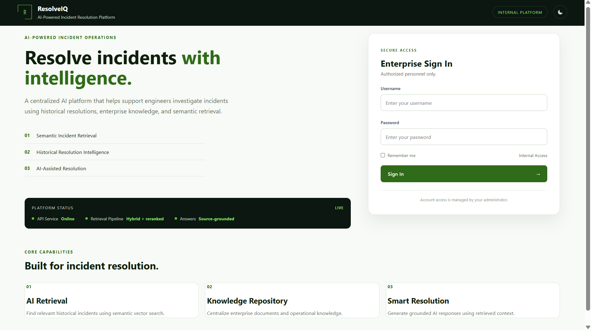
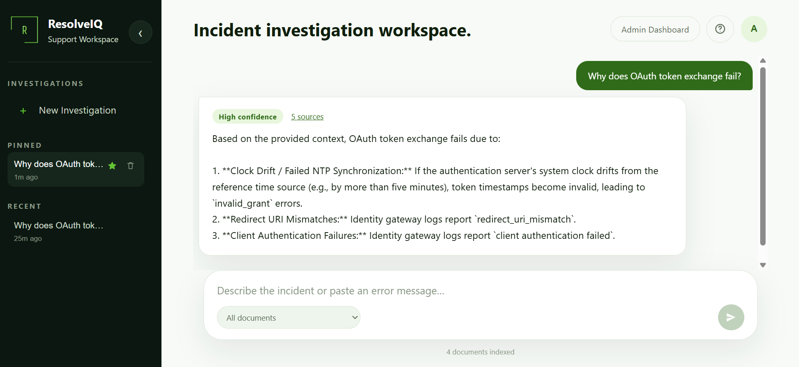
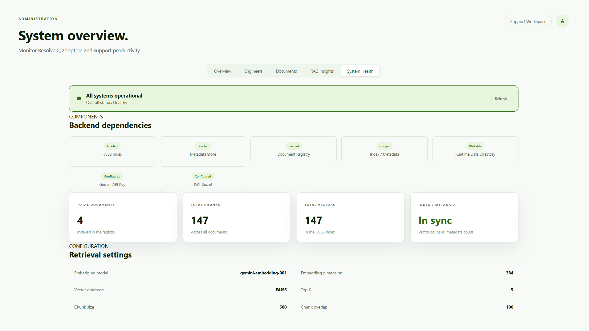

# ResolveIQ — AI-Powered Incident Resolution Platform

[](https://github.com/vishwakarmamukul8791-code/resolveiq-platform/actions/workflows/ci.yml)

ResolveIQ is a full-stack Retrieval-Augmented Generation (RAG) platform for investigating IT incidents against an internal knowledge base. It combines lexical and semantic retrieval, confidence-aware answer generation, grounded citations, engineer history, and an admin operations dashboard.

## Live application

- Frontend: [resolveiq-five.vercel.app](https://resolveiq-five.vercel.app)
- Backend health: [resolveiq-api-8lmh.onrender.com/health](https://resolveiq-api-8lmh.onrender.com/health)
- Repository: [GitHub](https://github.com/vishwakarmamukul8791-code/resolveiq-platform)

The Render Free backend can take up to a minute to wake after inactivity.

### 👀 Evaluating this for a role? Read this first.

The live demo above is **intentionally guest-only** — click "Try it without
logging in" and ask questions against a small set of public sample
documents. There's no way to log into the hosted instance itself: I don't
publish admin credentials to a public URL, since anyone could then delete
documents, spam the upload pipeline (real API cost), or reset other
accounts — the same reasons any real production app doesn't hand out
admin access on request.

**To see the full application — admin dashboard, document upload/delete,
engineer accounts, analytics, RAG insights, system health — it takes
about 5 minutes:**

```bash
git clone https://github.com/vishwakarmamukul8791-code/resolveiq-platform.git
cd resolveiq-platform
# follow "Local development" below, then:
python -m backend.seed_admin
```

That last command creates your own admin account on your own local
instance (own storage, own data — nothing shared with the live demo or
anyone else who clones this). Log in and you'll have an empty knowledge
base — upload the sample runbooks included in
[`demo-documents/`](demo-documents/) to try the full retrieval → confidence
→ generation pipeline in a couple of minutes, or upload your own files.
See [Local setup — Windows PowerShell](#local-setup--windows-powershell) below for the full setup.

Once uploaded, try asking:
- "Why does OAuth token exchange fail?"
- "What causes redirect_uri_mismatch errors?"
- "How do I fix database connection pool exhaustion?"
- "What's the immediate mitigation for a connection pool exhaustion incident?"

## Product screenshots

### Secure enterprise access



### Source-grounded incident resolution



### Administrative system health



<!--
  Optional: record a 30-60s screen capture (upload -> ask a question ->
  admin dashboard) and drop it in as either:
    1. A GIF committed to docs/screenshots/resolveiq-demo.gif, then:
       
    2. A Loom / YouTube link, then uncomment the line below and replace the URL:
       [Watch a 60-second walkthrough](https://your-video-link-here)
  This lets someone see the full admin flow without cloning anything.
-->

## What ResolveIQ does

- Authenticates admins and support engineers with JWT and role checks.
- Accepts PDF, CSV, and TXT knowledge-base documents.
- Extracts, cleans, chunks, embeds, and indexes document content.
- Combines BM25 and semantic vector results with Reciprocal Rank Fusion (RRF).
- Optionally reranks candidates with a cross-encoder.
- Sends retrieved context to Gemini only when evidence passes confidence gating.
- Returns source document, page, and location citations.
- Tracks investigation threads, sessions, confidence distribution, and knowledge gaps.
- Gives admins document, engineer, analytics, and health controls.
- Offers an optional no-login "guest" mode (`/try`) restricted to an explicit allow-list of public demo documents, for evaluators trying the product without an account.

## RAG pipeline

```text
Single incident question
        |
        v
Optional query rewrite (safe fallback to original)
        |
        +-----------------------+
        |                       |
        v                       v
BM25 lexical search      pgvector / FAISS search
        |                       |
        +-----------+-----------+
                    |
                    v
          Reciprocal Rank Fusion
                    |
                    v
        Optional cross-encoder rerank
                    |
                    v
       Retrieval-aware confidence gate
             /               \
            /                 \
       enough evidence       weak evidence
            |                     |
            v                     v
     grounded Gemini answer    safe abstention
            |
            v
   answer + citations + history
```

### Confidence safety contract

- RRF and cross-encoder scores use separate thresholds.
- A single weak retriever match stays Low confidence.
- Zero and negative BM25 scores are discarded before fusion.
- If Gemini returns its required no-information response, confidence is forced to Low and sources/supporting chunks are cleared.
- Multiple independent questions in one request return HTTP 422 with `Please ask one incident question at a time.` The current response model intentionally represents one incident answer and one confidence decision.

## Technology stack

| Area | Technology |
|---|---|
| Frontend | React 19, Vite, React Router |
| Backend | FastAPI, Python 3.12, Uvicorn |
| Answer generation | Google Gemini |
| Embeddings | Gemini in memory-constrained production; SentenceTransformers locally |
| Vector database | Supabase PostgreSQL + pgvector in production; FAISS locally |
| Lexical retrieval | BM25 (`rank-bm25`) |
| Fusion | Reciprocal Rank Fusion |
| Optional reranker | `cross-encoder/ms-marco-MiniLM-L-6-v2` |
| Authentication | JWT HS256, PBKDF2-HMAC-SHA256 |
| Persistent state | Supabase PostgreSQL, pgvector, and private Storage |
| Hosting | Vercel frontend, stateless Render backend, Supabase data layer |

## Project structure

```text
.
|-- app.py
|-- Dockerfile
|-- requirements.txt
|-- requirements-render.txt
|-- .env.example
|-- .github/workflows/ci.yml
|-- supabase/migrations/
|-- backend/
|   |-- eval/
|   |-- routes/
|   `-- services/
|-- frontend/
|   |-- src/
|   |-- package.json
|   `-- vercel.json
`-- tests/
```

Local development files are generated under `DATA_DIR` and ignored by Git.
Production uses Supabase instead:

```text
data/raw/                         uploaded source files
data/users.json                   user accounts
data/sessions.json                login sessions
data/document_registry.json       processed document registry
data/history/chat_history.json    investigation history
data/vector_store/index.faiss     vector index
data/vector_store/metadata.json   chunk metadata
```

## Local setup — Windows PowerShell

### 1. Clone and create the backend environment

```powershell
git clone https://github.com/vishwakarmamukul8791-code/resolveiq-platform.git
Set-Location resolveiq-platform

py -3.12 -m venv venv
.\venv\Scripts\Activate.ps1
python -m pip install --upgrade pip
pip install -r requirements.txt
```

### 2. Configure backend environment

```powershell
Copy-Item .env.example .env
python -c "import secrets; print(secrets.token_urlsafe(48))"
```

Put the generated value and your Gemini key in `.env`:

```env
ENVIRONMENT=development
GEMINI_API_KEY=your_gemini_api_key
JWT_SECRET_KEY=your_generated_secret
PERSISTENCE_BACKEND=local
DATA_DIR=data
FRONTEND_ORIGIN=
EMBEDDING_PROVIDER=local
EMBEDDING_MODEL=gemini-embedding-001
EMBEDDING_DIMENSION=384
ENABLE_CROSS_ENCODER=true
ENABLE_DEBUG_ROUTES=false
MAX_UPLOAD_SIZE_MB=10
```

### 3. Create the first admin and start the API

```powershell
python -m backend.seed_admin
uvicorn app:app --reload
```

Local API endpoints:

- API: `http://127.0.0.1:8000`
- Swagger: `http://127.0.0.1:8000/docs`
- Health: `http://127.0.0.1:8000/health`

### 4. Start the frontend

Open a second PowerShell window:

```powershell
Set-Location resolveiq-platform\frontend
Copy-Item .env.example .env
npm ci
npm run dev
```

The frontend runs at `http://localhost:5173` and uses `VITE_API_BASE_URL=http://localhost:8000` by default.

## Environment variables

| Variable | Required | Purpose |
|---|---:|---|
| `GEMINI_API_KEY` | Yes | Gemini answer generation and Gemini embeddings |
| `JWT_SECRET_KEY` | Yes | JWT signing and verification; must be a random value at least 32 characters long — short or common placeholder values are rejected at startup |
| `ENVIRONMENT` | No | Use `production` to disable API docs and local CORS origins |
| `FRONTEND_ORIGIN` | Production | Comma-separated allowed frontend origins |
| `TRUSTED_PROXY_COUNT` | No | Number of trusted reverse proxies in front of the API (e.g. Render's edge); defaults to `1`. Used to pick the correct client IP out of `X-Forwarded-For` for rate limiting instead of trusting a client-supplied value |
| `PERSISTENCE_BACKEND` | No | `local` for development or `supabase` for durable production state |
| `DATA_DIR` | Local only | Local runtime directory; defaults to repository `data/` |
| `SUPABASE_DATABASE_URL` | Supabase | Server-only PostgreSQL Session pooler URL |
| `SUPABASE_URL` | Supabase | Supabase project URL |
| `SUPABASE_SERVICE_ROLE_KEY` | Supabase | Server-only private Storage credential |
| `SUPABASE_STORAGE_BUCKET` | No | Private bucket; defaults to `resolveiq-documents` |
| `EMBEDDING_PROVIDER` | No | `local` or `gemini` |
| `EMBEDDING_MODEL` | No | Gemini embedding model name |
| `EMBEDDING_DIMENSION` | No | Embedding/index dimension; defaults to 384 |
| `ENABLE_CROSS_ENCODER` | No | Disable on memory-constrained instances |
| `QUERY_REWRITE_ENABLED` | No | Enables an optional Gemini rewrite call |
| `ENABLE_DEBUG_ROUTES` | No | Development-only admin retrieval diagnostics |
| `GUEST_MODE_ENABLED` | No | Enables the unauthenticated `POST /guest/ask` demo endpoint; off by default |
| `GUEST_ALLOWED_DOCUMENTS` | Guest mode | Comma-separated document names guest questions are restricted to; required whenever guest mode is on |
| `MAX_UPLOAD_SIZE_MB` | No | Maximum PDF/CSV/TXT upload size; defaults to 10 |
| `BOOTSTRAP_ADMIN_USERNAME` | Deployment | Idempotent first-admin bootstrap username |
| `BOOTSTRAP_ADMIN_PASSWORD` | Deployment | First-admin bootstrap password; keep secret |
| `BOOTSTRAP_ADMIN_RESET_VERSION` | No | Change to intentionally reset the bootstrap admin password |

## Production persistence

The Render service is stateless. Accounts, sessions, history, the document
registry, chunks, and embeddings persist in Supabase PostgreSQL; semantic
retrieval runs through pgvector; original source files persist in a private
Supabase Storage bucket. A Render restart or redeploy therefore does not reset
the admin password or erase application data.

Apply the SQL migration and configure Render by following
[the Supabase deployment guide](docs/SUPABASE_DEPLOYMENT.md).

## Docker

The production image uses the memory-efficient Render dependency set, Gemini embeddings, and disables the cross-encoder by default.

```powershell
docker build -t resolveiq-api .
docker run --rm -p 8000:8000 `
  -e ENVIRONMENT=production `
  -e GEMINI_API_KEY=your_key `
  -e JWT_SECRET_KEY=your_secret `
  -e FRONTEND_ORIGIN=http://localhost:5173 `
  -e SUPABASE_DATABASE_URL=your_session_pooler_url `
  -e SUPABASE_URL=https://your-project.supabase.co `
  -e SUPABASE_SERVICE_ROLE_KEY=your_server_only_key `
  -e BOOTSTRAP_ADMIN_USERNAME=admin `
  -e BOOTSTRAP_ADMIN_PASSWORD=replace_with_12_plus_chars `
  resolveiq-api
```

## Validation and CI

Run the same core checks locally:

```powershell
python -m compileall -q app.py backend tests
python -m unittest discover -s tests -p "test_*.py" -v

Set-Location frontend
npm ci
npm run lint
npm run build
Set-Location ..
```

The GitHub Actions workflow runs three independent jobs on pushes and pull requests:

- backend compilation and unit tests
- frontend lint and production build
- backend Docker image build

Offline retrieval evaluation (requires an existing local corpus and index):

```powershell
python -m backend.eval.run_eval
```

## Main API endpoints

| Method | Endpoint | Access |
|---|---|---|
| POST | `/auth/login` | Public |
| POST | `/auth/logout` | Authenticated |
| POST | `/auth/reset-password` | Authenticated |
| GET | `/auth/me` | Authenticated |
| POST | `/ask` | Authenticated, password reset complete |
| POST | `/guest/ask` | Public, only when `GUEST_MODE_ENABLED=true`; restricted to `GUEST_ALLOWED_DOCUMENTS` |
| GET | `/documents` | Authenticated, password reset complete |
| GET | `/document/{filename}` | Authenticated, password reset complete |
| GET/PATCH/DELETE | `/history...` | Authenticated, ownership scoped |
| POST | `/upload` | Admin |
| POST | `/process-document` | Admin |
| DELETE | `/document/{filename}` | Admin |
| GET | `/admin/system-health` | Admin |
| GET | `/debug/retrieval` | Admin, development-only when enabled |
| GET | `/health` | Public |
| GET | `/health/live` | Public liveness probe |
| GET | `/stats` | Public |

## Security and reliability controls

- Server-side current-user, active-status, role, and forced-password-reset checks
- PBKDF2 password hashing with per-user salts and constant-time verification
- Ownership checks for history and session mutations
- Filename/path traversal protection and file-content validation
- Streamed, size-bounded uploads with partial-file cleanup
- Transactional PostgreSQL writes with cross-instance advisory locks
- Private object storage for source documents
- Atomic chunk, embedding, and registry mutations through pgvector/PostgreSQL
- Provider timeout/error mapping without exposing provider internals
- Retrieval-method-aware confidence gating and LLM abstention downgrade
- UTC timestamps with legacy naive-UTC display compatibility
- Production API docs and retrieval debug routes disabled by default

## Current deployment limits

- Supabase Free may pause after extended inactivity and does not provide paid-tier uptime guarantees.
- Local JSON/FAISS mode is for development and is not durable on Render Free.
- Document processing is synchronous; large production workloads should use a background queue.
- JWT access tokens do not use refresh tokens or a server-side blocklist of individually revoked tokens. Instead, each user carries a `token_version` counter, stamped into every token issued to them; a password change (self-service or admin-triggered) increments it, which invalidates every token issued before that change on their very next request — regardless of that token's remaining 12h lifetime. Active status and password-reset state are also checked on every protected request.
- Retrieval thresholds should be recalibrated whenever the embedding model, corpus, or reranker changes.

## License

This project is licensed under the [MIT License](LICENSE).
